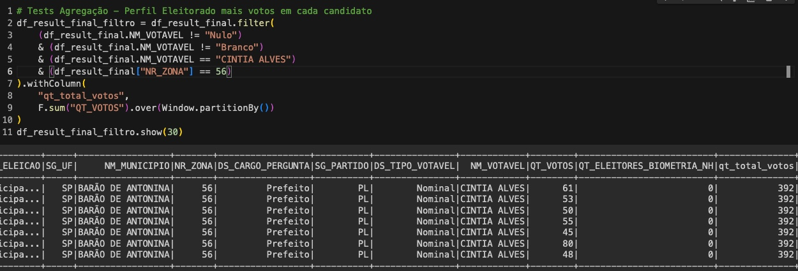
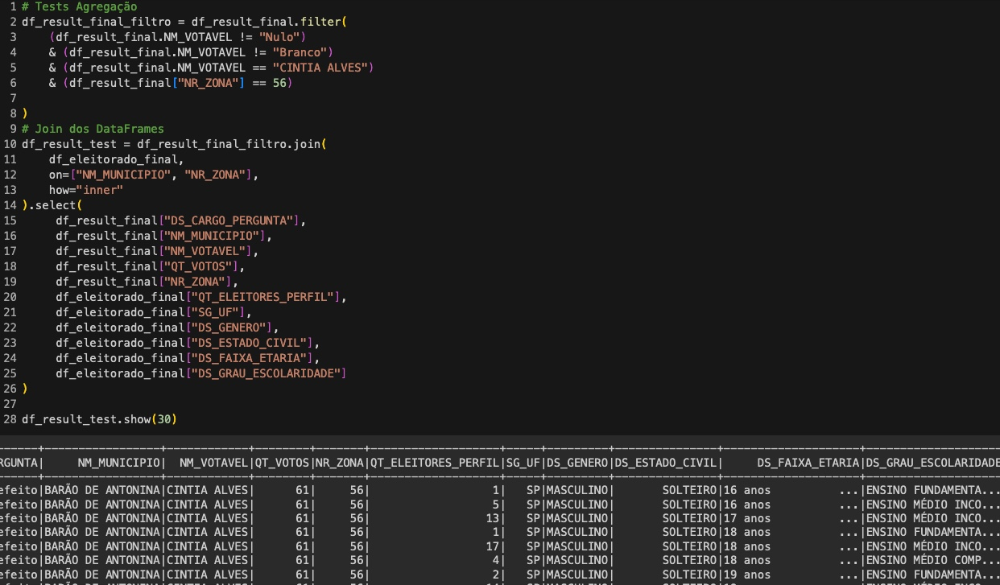

# Challenges

# Análise de Dados Eleitorais com PySpark

Este repositório contém um projeto de análise de dados eleitorais usando a biblioteca PySpark no ambiente do Google Colab. O objetivo é identificar:
* em qual município o candidato X foi mais votado;
* qual candidato foi mais votado em cada município;
* qual perfil do eleitorado (faixa etária, gênero, grau de escolaridade,
etc.) mais votou em cada candidato.

# Pré-requisitos
Certifique-se de ter o ambiente configurado com os seguintes requisitos:
* Python 3.x
* Spark 3.x
* Arquivos CSV contendo os dados do eleitorado (df_eleitorado.csv) e os resultados da eleição (df_result_final.csv).

# Instruções de Uso
1. Abra o notebook "new_notebook" no Google Colab.
1. Certifique-se de que você possui uma conta Google e que está logado no Colab.
1. Fazer o Upload dos Arquivos CSV:
* No exemplo mostrafo, foi feito o carregamento dos arquivos CSV via Google Drive.
* Na barra lateral esquerda, clique no ícone de pasta ("Files") para abrir a seção de arquivos.
* Clique no botão "Upload to session storage" e selecione os arquivos CSV necessários para a análise (por exemplo, dados_eleitorado.csv e dados_votos.csv).
* Troque o caminho do arquivo
1. Execute as células do notebook em ordem para carregar os dados e realizar a análise.
1. Os resultados serão exibidos diretamente no notebook, mostrando os resultados.

# Dados
* Os dados necessários para a análise estão disponíveis no ambiente do Google Colab(Caso for Compartilhar). 
* Certifique-se de fazer o upload dos arquivos CSV conforme as instruções acima.

# Resultados
Os resultados da análise demostram foi possivel responder as seuinte perguntas perguntas:
* em qual município o candidato X foi mais votado
* qual candidato foi mais votado em cada município

Com relação ao ultimo requisito: 
* qual perfil do eleitorado (faixa etária, gênero, grau de escolaridade,
etc.) mais votou em cada candidato

Não foi possivel indentificar o perfil dos eleitores, principalemente, devido a falta de algumas informação para que fosse possivel fazer uma conexão entre os votos recebidos pelo candidato e os votos por perfil, assim como demosntrado na célula:
* Tests Agregação - Perfil Eleitorado mais votos em cada candidato

* Tests verificar quantidade votos/Perfil

# Contribuições
Contribuições são bem-vindas! Sinta-se à vontade para abrir issues ou pull requests.
